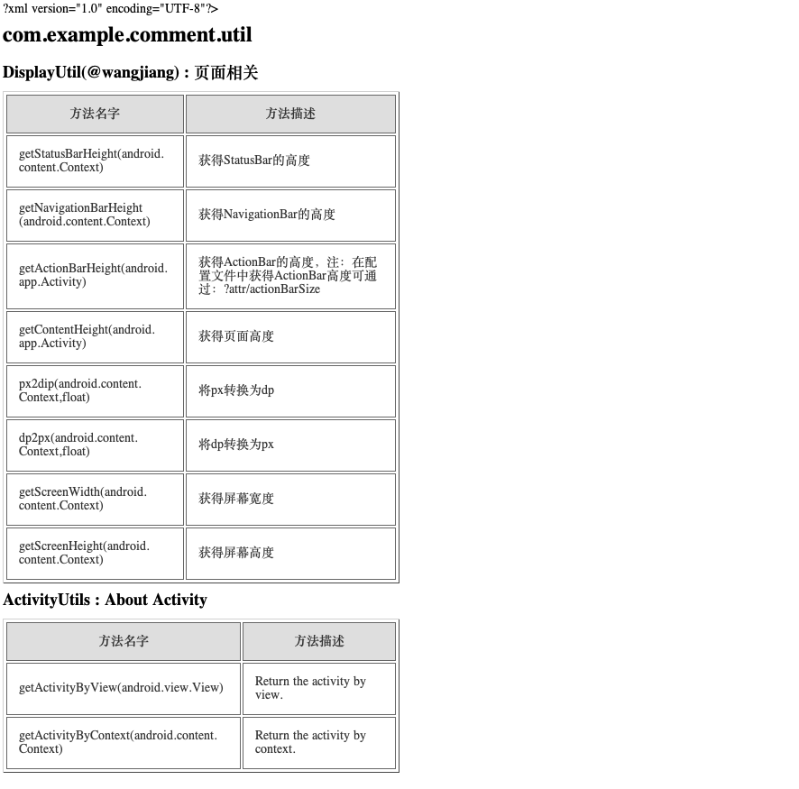

# comment
**comment** 的主要作用是将类注释扫描到文档中。通过在类中添加类注解`@Comment`，在项目编译的时候，生成`.java` 和`.html` 文档。`.java` 和`.html` 文档会把一个包下的每个类具有的方法汇聚到一起，帮助开发人员一览项目 API。

## 导入工具
在你要使用该工具的 Module 的 build.gradle 文件中添加依赖：

```
dependencies {
    annotationProcessor 'com.wangjiang:comment-doc:0.0.3'
    implementation 'com.wangjiang:comment-doc:0.0.3'
}
```

还可以在 build.gradle 文件中添加编译配置信息：

```
android {
    defaultConfig {
        javaCompileOptions {
            annotationProcessorOptions {
                arguments = [ debuggable : 'true',check_comment : 'true']
            }
        }
    }
}
```
arguments 参数表示意思：

 - debuggable：表示是否在控制台打印出相关日志信息，值为"true"打印，"false"不打印。
 - check_comment：表示是否会检查添加了注解`@Comment`的类有类或方法注释，值为"true"检查，在检查中发现类或方法没有注释就会编译失败，"false"不检查。

如果没有添加编译配置信息`debuggable` 或 `check_comment`，`debuggable`的默认值是"false"，`check_comment`的默认值是"true"。

## 使用简单介绍
1.在你需要生成注释文档的类中添加注解`@Comment`，如在工具类`DisplayUtil`中添加：

```
package com.example.comment.util;
/**
 * 页面相关
 *
 * @author wangjiang wangjiang7747@gmail.com
 * @version V1.0
 */
@Comment
public final class DisplayUtil {

    private DisplayUtil() {
        throw new UnsupportedOperationException("不能创建此对象");
    }

    /**
     * 获得StatusBar的高度
     *
     * @param context 上下文对象
     * @return 状态栏的高度
     */
    public static int getStatusBarHeight(Context context) {
        Resources resources = context.getResources();
        int resourceId = resources.getIdentifier("status_bar_height", "dimen",
                "android");
        int statusBarHeight = resources.getDimensionPixelSize(resourceId);
        return statusBarHeight;
    }
    //省略部分代码
}

```

2. 构建项目，运行`./gradlew build` 或 `./gradlew assembleDebug` 或 `./gradlew assembleRelease`命令。

3. 构建完成后，查看主 Module 下的目录`/build/generated/source/apt/debug/`，再找到你添加注解`@Comment`的类的包下，如上面类包名为`com.example.comment.util`，则你会在该包下看到文件：JavaCommentDoc.java 和 JavaCommentDoc.html。

4.查看生成的文件 JavaCommentDoc.java ：

```
package com.example.comment.util;
class JavaCommentDoc{
	/**
	*	{@link com.example.comment.util.DisplayUtil, 页面相关}
	*		{@link com.example.comment.util.DisplayUtil#getStatusBarHeight(android.content.Context), 获得StatusBar的高度}
	*		{@link com.example.comment.util.DisplayUtil#getNavigationBarHeight(android.content.Context), 获得NavigationBar的高度}
	*		{@link com.example.comment.util.DisplayUtil#getActionBarHeight(android.app.Activity), 获得ActionBar的高度，注：在配置文件中获得ActionBar高度可通过：?attr/actionBarSize}
	*		{@link com.example.comment.util.DisplayUtil#getContentHeight(android.app.Activity), 获得页面高度}
	*		{@link com.example.comment.util.DisplayUtil#px2dip(android.content.Context,float), 将px转换为dp}
	*		{@link com.example.comment.util.DisplayUtil#dp2px(android.content.Context,float), 将dp转换为px}
	*		{@link com.example.comment.util.DisplayUtil#getScreenWidth(android.content.Context), 获得屏幕宽度}
	*		{@link com.example.comment.util.DisplayUtil#getScreenHeight(android.content.Context), 获得屏幕高度}
	*
	*/
}
```
JavaCommentDoc.java 文件会把一个包下的每个类具有的方法汇聚到一起，可以通过AndroidStudio 的快捷键也可直接进入到原类。如果有多个包，则有多个JavaCommentDoc.java 文件。

查看生成的文件 JavaCommentDoc.html，需要在浏览器中打开：




JavaCommentDoc.html 和 JavaCommentDoc.java 表达的意思一样。
